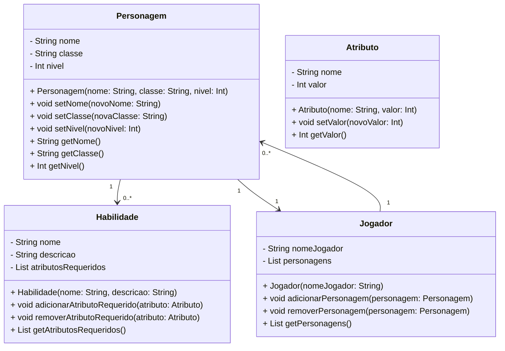

Claro, vou criar um diagrama de classe básico para um sistema de gerenciamento de RPG usando a sintaxe do Markdown Mermaid. Este será um exemplo simples, mas você pode expandi-lo conforme necessário para atender às suas necessidades específicas.

Neste diagrama:

- `Personagem` representa um personagem no jogo, com atributos como nome, classe e nível.
- `Jogador` representa um jogador que pode ter vários personagens.
- `Atributo` representa os atributos que um personagem pode ter, como força, agilidade, etc.
- `Habilidade` representa as habilidades que um personagem pode ter, com uma lista de atributos necessários para usá-las.

As associações mostram que um `Personagem` pode ter várias `Habilidades`, um `Jogador` pode ter vários `Personagens`, e um `Personagem` pertence a apenas um `Jogador`.